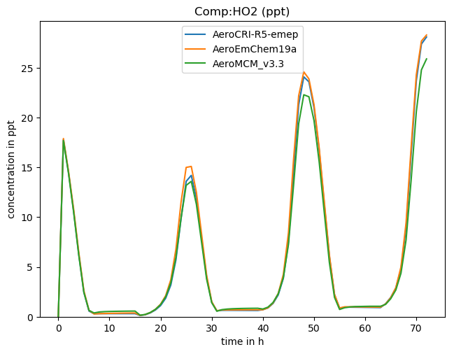

.. index:: Quick Start

Quick start
-----------

We will proceed directly to a run of the box-model system, to show how
chemical schemes are normally compiled into ``CM_`` and ``CMX_`` files, and used
in box-model simulations. This is actually the normal and recommended way to
prepare files for the EMEP model, but also provides a good environment for
comparing chemical mechanisms.

Step 1: initial setup
+++++++++++++++++++++

If not run previously, some preliminary steps are needed to set up a
working directory.  From the **GenChem/box** directory, do::

  cd somepath/GenChem-xxx/box

  scripts/box_setup.sh tmp_work
  

The name _tmp\_work is just an example - anything can be used.

Step 2: do.testChems
++++++++++++++++++++

At this stage, one can try compiling a chemical scheme. With the example of
EmChem19a, and now from our tmp_work directory, try::

  cd tmp_work

  ./do.testChems  EmChem19a

This script will run GenChem.py on the EmChem19a scheme (also adding
a few extra reactions from helper BoxAero, BoxBVOCemis and BoxDep
mechanisms), run "make", and then run the resulting box-model
code. Results will appear in one log-file (e.g. RES.EmChem19a),
and as comma-separated results in the Output directory (set in
do.testChems):  OUTPUTS_TEST/boxEmChem19a.csv.  This file is readable
with e.g. libreoffice. Plot scripts are also available (see next section),
for easy visualisation and comparison of these csv results.

The ``CM_`` and ``CMX_`` fortran files produced by this process are saved
in directories, e.g.  here in  ``ZCMBOX_EmChem19a``. These files could
be used in the EMEP model if wanted, but usually the more complex script
emep_setup.py (described below) is used for that. (Hence we reserve
the prefix ZCMBOX for files created by do.testChems and ZCM for those
created with emep\_setup.py, see below.)

Now, if one wants to compare several schemes, one can do e.g.::

  ./do.testChems  EmChem19a CRIv2R5Em MCMv3.3Em

This would produce 3 output .csv files, which again are easily plotted
against each other. 

Technical comments: 

   * do.testChems is just a simple wrapper, which cleans up files, runs another script (do.GenChem), compiles, and runs the box model, boxChem.

   * MCM is a very large scheme and this can take a while, or stress your PC's memory! Try with the smaller schemes first.

2a. Plotting? 
+++++++++++++

If one has run say 3 chemical schemes using Step 2 above, the results
are easily plotted from the *box/tmp_work/OUTPUT_TEST* directory::

  ../../scripts/boxplots.py -h     for help!

  ../../scripts/boxplots.py -v O3 -i boxEmChem19a.csv boxChem1.csv boxChem2.csv  -p

Using 'ALL' or 'DEF' with -v results in all or many common species being
plotted at once (-p is assumed in this case). For example, here we can
see a comparison of three schemes produced with this script:

Another crude+helpful script just grabs the concentrations::

  ../../scripts/getboxconcs.py  O3 boxEmChem19a.csv

which results in ResConcs_boxEmChem19a_O3_ppb.txt

.. 
  COMMENTED
  This assembles
  FAILED: .. emepweb: http://www.emep.int
  FAILED: .. |CM| replace:: CMfile

2b. Box-config 
++++++++++++++

The script do.testChems above compiles the executable boxChem for each mechanism in turn, and by default runs this using some settings from the default config\_box.nml file. This file contains a number of important settings which by deault run a 24-hour simulation (starting at 12:00 GMT), with set emissions, temperature of 298.15 K, mixing height of 1000 m, and some boundary conditions. Default outputs are also given.

The user can of course change these settings (do this in your working directory, not in *src*). We explain some the key variables and choices here, and further
information can be found in `Simpson et al 2020 <https://gmd.copernicus.org/preprints/gmd-2020-147/>`_.

*Note* these config files follow fortran namelist conventions. Text following
an exclamation mark (!) is ignored.

Time-related variables
......................
::

  ! Time variables, all in seconds
  ! ------------------------------
   tstart = 43200., ! start at 12:00
  ! end time is absolute time -> total runtime is tend - tstart!
   tend = 302400.,  ! three days on top of 12 hours
   tend = 129600.,  ! one day on top of 12 hours
   dt = 30.         ! time-step for numerical simulations
   doy = 182,        ! Day of the year

(In config files, variables can be given multiple times. The  last entry given is used, in this case we get tend = 129600 s.)

Geographical location
.....................
::

  lat = 45.05,    ! degrees N
  lon = 15.06,    ! degrees E

Emissions
.........
::

   use_emis = T,     ! use emissions at all?
  ! directory with emissplit files:
   emissplit_dir = 'emissplit_run/'
   emis_kgm2day = 'nox', 18.3, ! NOx, kg/m2/day, as in MCM/CRI tests
                  'voc', 15.4  ! NMVOC
   !emis_kgm2day = 'nox', 180.3, ! NOx, kg/m2/day, as in MCM/CRI tests
   !               'voc', 150.4  ! NMVOC

   ! BVOC emissions are set in chem/extra_mechanisms/BoxBVOCemis, where
   ! also a factor SUN is given for light-dependent emissions. These BVOC
   ! emissions can be adjusted with the factors below.

   fIso = 1.0,                     ! isoprene
   fMTL = 0.0,                     ! monoterpenes from light-dependent emissions
   fMTP = 0.0,                     ! monoterpenes from pool (Temp.)-dependent emissions
   fSQT = 0.0,                     ! sesqui-terpenes

Outputs
.......
::

   ! Can say just e.g. 'O3', to reduce size of outputs,
   !  but in general usage 'all' is normally best.
   
     OutSpecs_list =
     'all', 'ppb'    ! Will switch to ug for OM
   
   ! Output Groups
   ! --------------
     OutGroups_list =
     'NOX',   'ppb',

Debug
.....

Some flags produce more output. More documentation to be added later.
::

   ! -----
  
   ! For testing, one can assign all VOC to one species. Do that here:
   !  dbgVOC = 'NODEBUG',
   !  dbgVOC = 'C2H4',
     debug%Emis = 0
   !  debug%VOC = 'C2H4'
     debug%Spec = 'NONE', !'C2H4'
     debug%SOA = 0
     debug%PM = .false.
     debug%Chem = .false.

Step 3: emep_setup.py
+++++++++++++++++++++

The do.testChems script described above is best for quickly testing and 
comparing different mechanisms. Usually these comparisons only involve
gas-phase mechanisms such as EmChem19a or MCMv3.3Em. However, the EMEP
model usually requires a host of extra species and reactions to 
accommodate sea-salt, dust, organic aerosols, and pollen.
It also requires files to specify how emissions and boundary
conditions should be distributed among specific species, e.g.
how a VOC emission should be split into C2H6, C2H4, nC4H10 etc.

In fact, for the EMEP model, GenChem produces many files which are
copied into ZCM\_XXX directories for the scheme XXX you wish to use: 

   $ls -x ZCM_EmChem19a/

    CM_ChemDims_mod.f90                     CM_ChemGroups_mod.f90
    CM_ChemRates_mod.f90                    CM_ChemSpecs_mod.f90
    CM_DryDep.inc                           CM_EmisFile.inc
    CM_emislist.csv                         CM_EmisSpecs.inc
    CM_Reactions1.inc                       CM_Reactions2.inc
    CM_Reactions.log                        CM_WetDep.inc
    CMX_BiomassBurningMapping_FINNv1.5.txt  CMX_BiomassBurningMapping_GFASv1.txt
    CMX_BoundaryConditions.txt              config_box.nml
    run_emislist/  (with emislist_defaults_sox.csv etc..)

The recommended way to get this directory is to use the script *emep_setup.py* from your temporary work directory
within  the **box** system. So, from e.g. box/tmp_work, do:

  ./emep_setup.py  EmChem19a

or just::

  ./emep_setup.py

and this will provide a list of options.

You can edit the *emep_setup.py* scripts, maybe renaming it as *my_setup.py* directory. 
If selecting from the provided base\_mechanisms and extra\_mechanisms you only need to extend
the possible command lines as provided by the *cmdx*  dictionary::

  cmdx['EmChem19a-vbs'] ='-b EmChem19a -e PM_VBS_EmChem19 '+common_IsoMT1
  cmdx['CRIv2R5Em-M19'] ='-b CRIv2R5Em -e PM_JPAC_MT3 PM_Hodzic_Aromatics BVOC_XTERP_CRI'+common_IsoMT3'

The '-b' argument gives the base mechanism, and then you can have any number of compatable extra mechanisms (-e argument).

(There are many possible combinations of packages - see
`Simpson et al 2020 <https://gmd.copernicus.org/preprints/gmd-2020-147/>`_
 and the emep_setup.py code for many examples.)

Any keys from *cmdx* can be used by *emep_setup.py*. For example, if the user builds a new base scheme *usersChem* and
some OA scheme, *usersSOA*, then *emep_setup.py* can be edited to add these as a new option::

  cmdx['usersChem'] ='-b usersChem -e  usersSOA'+common

you could do::

  do.testChems usersChem   # GOOD TO CHECK FIRST

  emep_setup.py usersChem  # Creates ZCM_usersChem

UPDATE 2022-06: Choice of GNFR_CAMS or SNAP
+++++++++++++++++++++++++++++++++++++++++++

GenChem was originally developed when the EMEP CTM used the so-called SNAP emission sector system, which has 11 source categories.
The EMEP model currently uses a 19-sector system we refer to as GNFR_CAMS. To produce EMEP-ready files with GenChem
one now needs to specify "-g" in the call to emep_setup.py, e.g.

  ./emep_setup.py  EmChem19a-vbs -g

Omission of this -g flag simply gives the 11-sector SNAP splits, though this option is now deprecated.

Step 4: Use for EMEP CTM
++++++++++++++++++++++++

After emep_setup.py has successfully run, the ZCM_ directory produced
contains all the files needed to run the EMEP CTM.  The CM_ and CMX_
files can be copied directly to the CTM's source directory, and the EMEP
model compiled as normal (make clean, make).  The emissplit_run files
need to be sent to a location specified by the user (via the EMEP CTMs'
emep_config.nml namelist).

.. comment::

  **  NOTE !!
  This user-guide is a work-in-progress manual on the GenChem system,
  with this interim version produced for interested users, Apr. 2020.
  **
